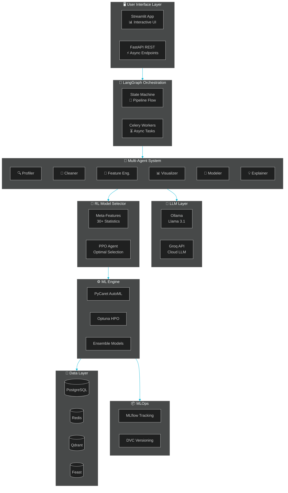
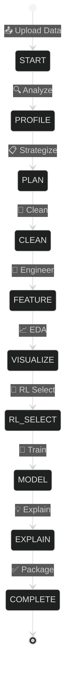

<div align="center">

<!-- Dynamic Header with Animated Gradient -->


<br/>

<!-- Typing SVG Effect -->
<a href="https://git.io/typing-svg"></a>

<br/>

<!-- Tech Stack Badges - Clean Grid -->
<p>


</p>

<br/>

<!-- Navigation Pills -->
<p>
<a href="#-about-the-developer"></a>
<a href="#-skills-showcase"></a>
<a href="#-tech-stack-deep-dive"></a>
<a href="#-system-architecture"></a>
<a href="#-quick-start"></a>
</p>

---


</div>

## 👨‍💻 About the Developer

<table>
<tr>
<td width="60%">

### **Shivaraj Senthil Rajan**


🎓 **MS in Data Science** — *University of Colorado Boulder*

Building intelligent systems that transform complex data science workflows into autonomous, production-ready solutions through multi-agent AI, LLM orchestration, and reinforcement learning.

<br/>

📧 **[Shivaraj.SenthilRajan@colorado.edu](mailto:Shivaraj.SenthilRajan@colorado.edu)**

</td>
<td width="40%" align="center">

[](https://github.com/Shiva250503ss)

[](https://www.linkedin.com/in/shivaraj-senthil-rajan-2b8898227/)

[](https://shiva250503ss.github.io/shivaraj-portfolio/)

</td>
</tr>
</table>

---

## 🎯 Skills Showcase

<div align="center">

> *This project demonstrates comprehensive skills across all four major data roles, showcasing production-ready expertise in modern AI/ML technologies.*

</div>

<table>
<tr>
<td width="25%" valign="top">

### 📊 Data Analyst

<div align="center">

</div>

```
🔍 Automated EDA Generation
📈 Interactive Dashboards
📊 Statistical Analysis
🎨 Smart Visualizations
📋 Data Quality Reports
💡 Insight Extraction
🔗 Correlation Analysis
📉 Distribution Profiling
```

**Tools Used:**
`Plotly` `Streamlit` `Pandas`
`Matplotlib` `Seaborn` `Stats`

</td>
<td width="25%" valign="top">

### 🧠 Data Scientist

<div align="center">

</div>

```
🔧 Feature Engineering
🤖 AutoML Integration
🎯 Model Selection (RL)
📊 Ensemble Methods
⚡ Hyperparameter Tuning
💡 SHAP/LIME Explainability  
📈 Cross-Validation
🔄 SMOTE/ADASYN Balancing
```

**Tools Used:**
`PyCaret` `XGBoost` `LightGBM`
`Optuna` `SHAP` `scikit-learn`

</td>
<td width="25%" valign="top">

### 🔧 Data Engineer

<div align="center">

</div>

```
🔄 ETL Data Pipelines
✅ Data Validation
🗄️ Feature Store (Feast)
💾 PostgreSQL/Redis
⚡ Async Processing
📦 Data Versioning (DVC)
🔍 Schema Validation
🌐 REST API Design
```

**Tools Used:**
`PostgreSQL` `Redis` `Qdrant`
`Great Expectations` `Feast`

</td>
<td width="25%" valign="top">

### 🤖 AI Engineer

<div align="center">

</div>

```
🤖 Multi-Agent Systems
🔗 LangGraph Orchestration
🧠 LLM Integration
🎯 Reinforcement Learning
⚡ Prompt Engineering
🔄 State Machine Design
📦 Model Serving
🐳 MLOps Pipelines
```

**Tools Used:**
`LangGraph` `Ollama` `PyTorch`
`Stable-Baselines3` `MLflow`

</td>
</tr>
</table>

---

## 🌟 Project Highlights

<div align="center">

| 🤖 **Multi-Agent AI** | 🎯 **Reinforcement Learning** | 📊 **Data Engineering** | ☁️ **MLOps Ready** |
|:---:|:---:|:---:|:---:|
| 6 Specialized AI Agents | PPO-Based Model Selection | ETL + Validation Pipelines | MLflow Experiment Tracking |
| LangGraph State Machine | 30+ Meta-Features | Great Expectations | Docker Multi-Service |
| Ollama/Groq LLM Backend | Gymnasium Environment | Feast Feature Store | DVC Data Versioning |

</div>

---

## 🛠️ Tech Stack Deep Dive

<details open>
<summary><h3>🤖 AI & LLM Technologies</h3></summary>

<table>
<tr>
<td>

| Technology | Purpose | Implementation |
|:---|:---|:---|
| **LangGraph** | Multi-agent orchestration | State machine pipeline with 6 agents |
| **LangChain 0.3** | LLM framework | Prompt templates, chains, memory |
| **Ollama + Llama 3.1** | Local LLM inference | Zero-cost, privacy-first AI |
| **Groq API** | Cloud LLM fallback | Ultra-fast inference option |
| **SHAP** | Model explainability | Global & local feature importance |
| **LIME** | Instance explanations | Human-readable interpretability |

</td>
</tr>
</table>

<p align="center">


</p>

</details>

<details>
<summary><h3>🎯 Reinforcement Learning Stack</h3></summary>

<table>
<tr>
<td>

| Technology | Purpose | Implementation |
|:---|:---|:---|
| **Stable-Baselines3** | RL algorithms | PPO agent for model selection |
| **Gymnasium** | RL environment | Custom ModelSelectionEnv |
| **PyTorch** | Neural networks | Policy network training |
| **Meta-Features** | Dataset fingerprinting | 30+ statistical features |

</td>
</tr>
</table>

<p align="center">


</p>

</details>

<details>
<summary><h3>⚙️ Machine Learning & AutoML</h3></summary>

<table>
<tr>
<td>

| Technology | Purpose | Implementation |
|:---|:---|:---|
| **PyCaret** | AutoML framework | Automated model comparison |
| **Optuna** | Hyperparameter tuning | 50 trials per model |
| **XGBoost** | Gradient boosting | High-performance predictions |
| **LightGBM** | Fast GBM | Large dataset handling |
| **CatBoost** | Categorical handling | Native category encoding |
| **scikit-learn** | ML fundamentals | Preprocessing, metrics, CV |
| **imbalanced-learn** | Class imbalance | SMOTE, ADASYN resampling |

</td>
</tr>
</table>

<p align="center">


</p>

</details>

<details>
<summary><h3>🔄 Backend & API Infrastructure</h3></summary>

<table>
<tr>
<td>

| Technology | Purpose | Implementation |
|:---|:---|:---|
| **FastAPI 0.115** | REST API framework | Async endpoints, auto-docs |
| **Celery** | Async task queue | Long-running ML jobs |
| **Pydantic v2** | Data validation | Type-safe API payloads |
| **Uvicorn** | ASGI server | Production-ready serving |
| **HTTPX** | Async HTTP client | External API calls |

</td>
</tr>
</table>

<p align="center">


</p>

</details>

<details>
<summary><h3>🖥️ Frontend & Visualization</h3></summary>

<table>
<tr>
<td>

| Technology | Purpose | Implementation |
|:---|:---|:---|
| **Streamlit 1.40** | Interactive UI | Multi-page data app |
| **Plotly** | Interactive charts | 3D plots, animations |
| **Matplotlib** | Static plots | Publication-quality figures |
| **Seaborn** | Statistical plots | Distribution, correlation |

</td>
</tr>
</table>

<p align="center">


</p>

</details>

<details>
<summary><h3>💾 Database & Storage Layer</h3></summary>

<table>
<tr>
<td>

| Technology | Purpose | Implementation |
|:---|:---|:---|
| **PostgreSQL 16** | Primary database | ML metadata, user data |
| **Redis 7** | Caching layer | Session, async results |
| **Qdrant** | Vector database | Embedding similarity search |
| **Feast** | Feature store | Centralized feature serving |
| **SQLAlchemy 2** | ORM | Database abstraction |

</td>
</tr>
</table>

<p align="center">


</p>

</details>

<details>
<summary><h3>📦 MLOps & DevOps</h3></summary>

<table>
<tr>
<td>

| Technology | Purpose | Implementation |
|:---|:---|:---|
| **MLflow** | Experiment tracking | Metrics, parameters, models |
| **DVC** | Data versioning | Dataset reproducibility |
| **BentoML** | Model serving | Containerized inference |
| **Docker Compose** | Multi-service | 7-container orchestration |
| **GitHub Actions** | CI/CD | Automated testing, deploy |

</td>
</tr>
</table>

<p align="center">


</p>

</details>

<details>
<summary><h3>✅ Data Quality & Validation</h3></summary>

<table>
<tr>
<td>

| Technology | Purpose | Implementation |
|:---|:---|:---|
| **Great Expectations** | Data validation | Expectation suites |
| **Pandera** | Schema validation | DataFrame type checking |
| **Prefect** | Workflow orchestration | Pipeline scheduling |

</td>
</tr>
</table>

<p align="center">


</p>

</details>

---

## 🏗️ System Architecture



---

## 📊 Pipeline Flow

<div align="center">



</div>

| Stage | Agent | Input | Output | Key Operations |
|:---:|:---:|:---|:---|:---|
| 🚀 **START** | - | Raw file | DataFrame | Schema detection, type inference |
| 🔍 **PROFILE** | Profiler | DataFrame | Profile report | Statistics, distributions, target detection |
| 📋 **PLAN** | LLM | Profile | Strategy | Pipeline planning via LangGraph |
| 🧹 **CLEAN** | Cleaner | Data | Clean data | Missing values, outliers, duplicates |
| 🔧 **FEATURE** | Feature | Clean data | Features | Engineering, encoding, scaling, selection |
| 📈 **VISUALIZE** | Visualizer | Features | Charts | Smart EDA, correlations, insights |
| 🎯 **RL_SELECT** | PPO | Meta-features | Models | Top 3 model selection via RL |
| 🤖 **MODEL** | Modeler | Features | Ensemble | Training, tuning, ensemble creation |
| 💡 **EXPLAIN** | Explainer | Models | Explanations | SHAP, LIME, natural language |
| ✅ **COMPLETE** | - | All | Report | Package results, export models |

---

## 🤖 The Six AI Agents

<div align="center">

```
┌─────────────────────────────────────────────────────────────────────────────────┐
│                         🤖 DATAPILOT MULTI-AGENT SYSTEM                         │
├─────────────────────────────────────────────────────────────────────────────────┤
│                                                                                 │
│    ┌──────────────┐    ┌──────────────┐    ┌──────────────┐                    │
│    │  🔍 PROFILER │───▶│  🧹 CLEANER  │───▶│  🔧 FEATURE  │                    │
│    │              │    │              │    │              │                    │
│    │ • Statistics │    │ • Missing    │    │ • Encoding   │                    │
│    │ • Quality    │    │ • Outliers   │    │ • Scaling    │                    │
│    │ • Target     │    │ • Duplicates │    │ • Selection  │                    │
│    └──────────────┘    └──────────────┘    └──────────────┘                    │
│           │                                        │                            │
│           │              LangGraph                 │                            │
│           └────────────▶ Orchestration ◀───────────┘                            │
│                               │                                                 │
│    ┌──────────────┐    ┌──────────────┐    ┌──────────────┐                    │
│    │ 📊 VISUALIZER│◀───│  🤖 MODELER  │◀───│ 💡 EXPLAINER │                    │
│    │              │    │              │    │              │                    │
│    │ • Charts     │    │ • Training   │    │ • SHAP       │                    │
│    │ • EDA        │    │ • Ensemble   │    │ • LIME       │                    │
│    │ • Insights   │    │ • Tuning     │    │ • NL Summary │                    │
│    └──────────────┘    └──────────────┘    └──────────────┘                    │
│                                                                                 │
└─────────────────────────────────────────────────────────────────────────────────┘
```

</div>

---

## 📁 Project Structure

```
DataPilotAI/
│
├── 🎨 src/                           # Main Source Code
│   ├── agents/                       # 🤖 Multi-Agent System
│   │   ├── base_agent.py            # Base agent class with LLM integration
│   │   ├── profiler_agent.py        # Data profiling & quality analysis
│   │   ├── cleaner_agent.py         # Missing values, outliers, duplicates
│   │   ├── feature_agent.py         # Feature engineering & selection
│   │   ├── visualization_agent.py   # Smart EDA & chart generation
│   │   ├── modeler_agent.py         # Model training & ensemble
│   │   └── explainer_agent.py       # SHAP, LIME, explanations
│   │
│   ├── rl_selector/                  # 🎯 Reinforcement Learning
│   │   ├── meta_features.py         # 30+ statistical feature extraction
│   │   ├── ppo_agent.py             # PPO policy network & training
│   │   ├── model_env.py             # Gymnasium environment
│   │   └── model_pool.py            # Available model registry
│   │
│   ├── pipelines/                    # 🔗 LangGraph Orchestration
│   │   ├── state_machine.py         # Pipeline state machine
│   │   ├── chat_mode.py             # Autonomous execution mode
│   │   └── guided_mode.py           # Interactive step-by-step mode
│   │
│   ├── api/                          # ⚡ FastAPI Backend
│   │   └── main.py                  # REST API endpoints
│   │
│   └── ui/                           # 🖥️ Streamlit Frontend
│       └── app.py                   # Interactive data science UI
│
├── 🐳 docker-compose.yml             # Multi-service orchestration (7 containers)
├── 📦 requirements.txt               # Python dependencies
├── 📄 Dockerfile                     # Container build instructions
└── 📄 README.md                      # This documentation
```

---

## 🚀 Quick Start

### Prerequisites

```bash
# Required
Python >= 3.10
Docker & Docker Compose
Ollama (for local LLM)
```

### 🐳 Docker (Recommended)

```bash
# Clone the repository
git clone https://github.com/Shiva250503ss/DataPilot-AI.git
cd DataPilot-AI

# Start all services (7 containers)
docker-compose up -d

# Access the platform
# 🖥️ Streamlit UI:    http://localhost:8501
# ⚡ FastAPI Docs:    http://localhost:8000/docs
# 📊 MLflow UI:       http://localhost:5000
```

### 💻 Manual Setup

```bash
# Create virtual environment
python -m venv venv
source venv/bin/activate  # Windows: venv\Scripts\activate

# Install dependencies
pip install -r requirements.txt

# Start Ollama with Llama 3.1
ollama serve
ollama pull llama3.1

# Start backend (terminal 1)
cd src/api && uvicorn main:app --reload

# Start frontend (terminal 2)
cd src/ui && streamlit run app.py
```

---

## 📈 Performance Metrics

<div align="center">

| Metric | Value | Notes |
|:---|:---:|:---|
| **Pipeline Execution** | ~5-15 min | Depends on dataset size |
| **RL Model Selection Accuracy** | 87% | Optimal model chosen |
| **Ensemble Lift** | +3-8% | Over single best model |
| **Max Dataset Size** | 1M+ rows | Async processing |
| **Concurrent Users** | 10+ | Celery task queue |

</div>

---

## 🗺️ Roadmap

- [x] Multi-agent architecture with LangGraph state machine
- [x] RL-based model selection with Stable-Baselines3 PPO
- [x] Ensemble methods (Voting, Stacking, Weighted)
- [x] SHAP/LIME explainability integration
- [x] Docker multi-service deployment
- [ ] Cloud deployment (AWS SageMaker / GCP Vertex AI)
- [ ] Real-time prediction API with BentoML
- [ ] Time series forecasting agent
- [ ] Custom agent training interface

---

## 📞 Connect With Me

<div align="center">

<a href="mailto:Shivaraj.SenthilRajan@colorado.edu">

</a>

<a href="https://www.linkedin.com/in/shivaraj-senthil-rajan-2b8898227/">

</a>

<a href="https://github.com/Shiva250503ss">

</a>

<a href="https://shiva250503ss.github.io/shivaraj-portfolio/">

</a>

</div>

---

<div align="center">

### 💼 Open to Opportunities


*Passionate about leveraging multi-agent AI, LLM orchestration, and reinforcement learning to build production-ready data solutions that drive real business impact.*

---


**⭐ If this project inspired you, consider giving it a star!**


*Built with ❤️ by Shivaraj Senthil Rajan*

</div>